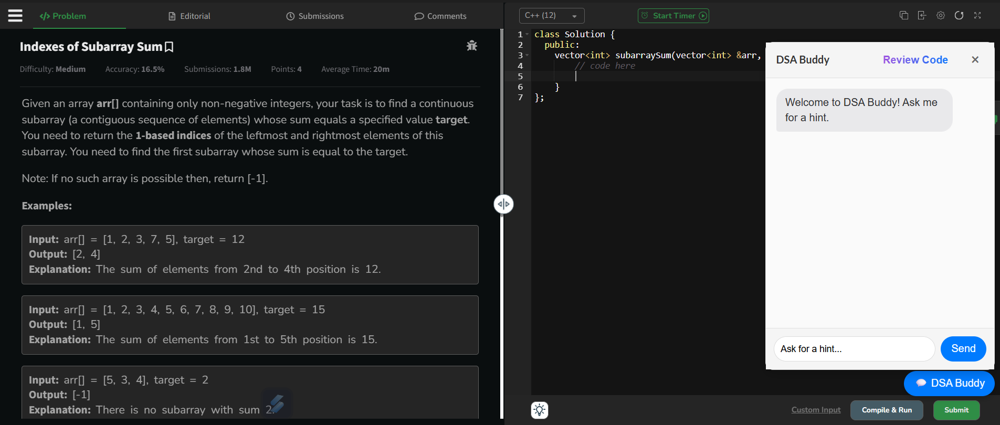
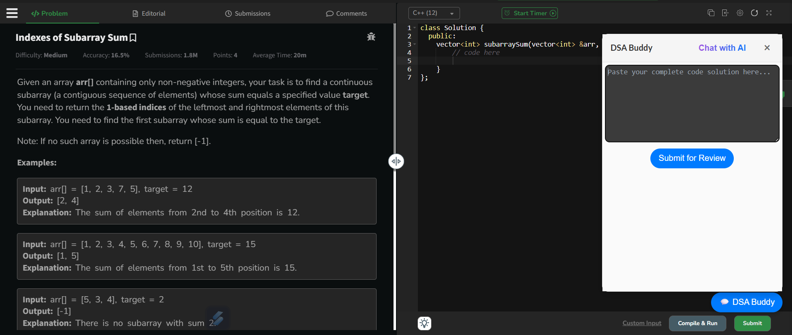

# 🧠 DSA Buddy – AI-Powered Chrome Extension for Coding Help

DSA Buddy is a Chrome extension that brings real-time, Gemini-powered AI assistance directly to your favorite coding platforms like **LeetCode**, **GeeksforGeeks**, and **HackerRank**. Whether you're stuck on a problem or want feedback on your code, DSA Buddy is your go-to assistant.


## 🚀 Features

✅ **In-Page AI Chatbox**  
Ask for hints, clarifications, or strategies — all without switching tabs.

✅ **Code Review Mode**  
Paste your solution and get a detailed code review with:
- Time & space complexity
- Missed edge cases
- Alternative approaches

✅ **Smart Problem Detection**  
Automatically fetches the problem description from supported sites.

✅ **Local Chat Memory per Problem**  
Remembers your past messages per problem — like your own DSA diary.

✅ **Custom Gemini API Key Support**  
Plug in your own Google Gemini API key — no backend needed!

✅ **Fully Responsive & Stylish UI**  
Gradient highlights, modern scrollbar, animations — feels native and clean.


## 🔧 Supported Platforms

- [LeetCode](https://leetcode.com/)
- [GeeksforGeeks](https://www.geeksforgeeks.org/)

(You can easily extend it to more sites!)


## 🛠️ Installation Guide

### 1. **Clone or Download the Repo**
```bash
git clone https://github.com/Akash4406pal/dsa-buddy.git
cd dsa-buddy
```

Or download the ZIP from GitHub and extract it.

### 2. **Install Dependencies**
```bash
npm install
```

### 3. **Build the Extension**
```bash
npm run build
```
This generates the `dist/` folder with everything Chrome needs.

### 4. **Load into Chrome**
1. Open Chrome and go to: `chrome://extensions`
2. Enable **Developer Mode** (top right)
3. Click **Load unpacked**
4. Select the generated `dist/` folder

---

## 🔑 Getting Your Gemini API Key

You need a **free API key** from Google AI Studio:

1. Visit [https://aistudio.google.com/app/apikey](https://aistudio.google.com/app/apikey)
2. Sign in with your Google account
3. Generate an API key
4. Paste it into the DSA Buddy popup settings

> 🔐 The API key is securely stored using Chrome’s `chrome.storage.local`.

---

## 📦 Tech Stack

- ⚛️ **React** + **Vite**
- 🧠 **Google Gemini API (1.5 Flash)**
- 💬 **React-Markdown** for reviews
- 🎨 **Framer Motion** for animations
- 🌐 **Chrome Extension APIs**
- 🧪 **Bootstrap** for UI enhancements

---

## 📁 Project Structure

```
dsa-buddy/
├── dist/                      # Build output (ignored by Git)
├── node_modules/              # Dependencies (ignored by Git)
├── public/
│   ├── icon48.png
│   └── manifest.json          # Chrome extension config
├── src/
│   ├── components/
│   │   ├── App.jsx            # Popup settings UI
│   │   ├── DSABuddyChatbox.jsx# Main chat + review chatbox
│   │   ├── index.css          # Global styles
│   │   └── reviewMode.jsx     # Code review UI logic
│   ├── content.jsx            # Content script entry (injects chatbox)
│   └── main.jsx               # React entry for popup.html
├── .gitignore
├── dist.crx                  # Extension packaged (ignored by Git)
├── dist.pem                  # Private key (ignored by Git)
├── index.html                # Chrome popup layout
├── package.json
├── package-lock.json
├── README.md
├── vite.config.js
├── vite.config.content.js    # Vite config for content scripts
```

---

## 💡 Planned Features

- [ ] Support for Codeforces, AtCoder, InterviewBit
- [ ] Voice Hints (Text-to-Speech)
- [ ] Offline Hint Cache
- [ ] Light/Dark Mode Toggle
- [ ] Export Code Reviews to PDF or Markdown

---

## 📸 Previews (Add Your Own Screenshots)

> _Below are placeholders. Replace with your own screenshots._

  
*Chatbox giving hints*

  
*Detailed AI review of user code*

---

## 🙌 Acknowledgements

- [Google AI Studio](https://aistudio.google.com/) — Gemini API
- [LeetCode](https://leetcode.com/) & [GFG](https://www.geeksforgeeks.org/) — Problem platforms
- [React-Markdown](https://github.com/remarkjs/react-markdown)
- [Bootstrap](https://getbootstrap.com/)
- [Framer Motion](https://www.framer.com/motion/)

---

## ✨ Author

**Akash Pal**  
_“Chasing Kaizen, not perfection ✨”_  
[GitHub](https://github.com/Akash4406pal) · [LinkedIn](https://www.linkedin.com/in/akash-pal-383734324)

---

## 📜 License

This project is licensed under the **MIT License** — use freely, modify openly, and give credit where it's due.

---

> Made with ❤️ to help coders solve smarter, not harder.
